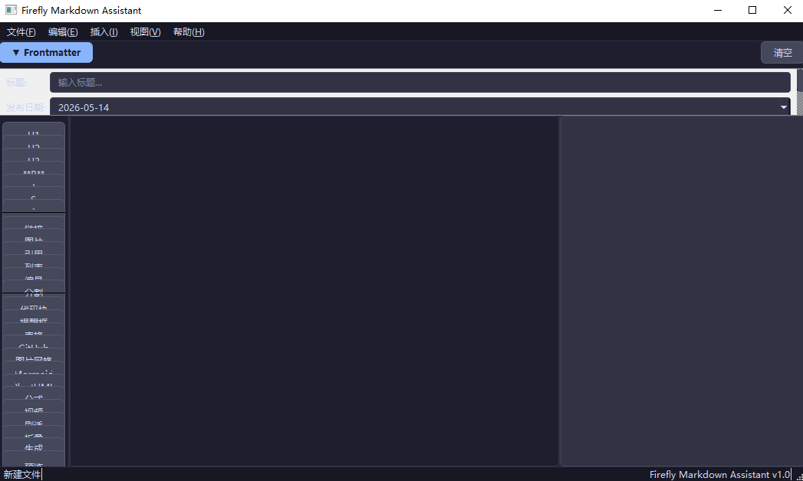

# Firefly Markdown Assistant

一款专为 [Firefly Astro 博客主题](https://github.com/CuteLeaf/Firefly) 设计的 Markdown 文章可视化辅助生成工具。

::github{repo=EnkanSakura/Firefly-content-assistant}

---

## ✨ 简介

由于对该模板不熟悉，撰写文章时需要一直对照文档来编排md格式，于是vibe了该程序

同时也顺便体验了dsv4的能力，目前感觉性能不错，且价格十分友好

## 📸 界面预览

## ❌ Bug

快捷键未能正常生效

程序内置预览和blog 不一致，程序仅用于便捷生成md代码，最终效果请参考pnpm dev 页面的呈现效果

以上不影响实际使用，暂无修复的计划（工具仅用于快速生成.md文件，实际效果请参考dev页面）

## TODO

- [ ]  移植到web，方便使用移动设备撰写文章

- [ ]  修复Bug（不影响使用，优先级较低）

## 🛠️ 技术栈

| 技术 | 用途 |
|------|------|
| **Python 3.12** | 编程语言 |
| **PySide6** | Qt 6 的 Python 绑定，提供原生 GUI |
| **Catppuccin Mocha** | 暗色主题配色方案 |

## 🤖 Vibe Coding

本项目由 **Vibe Coding** 方式完成——通过自然语言描述需求，由 AI 辅助完成编码。

| 项目 | 信息 |
|------|------|
| **AI 工具** | [DeepSeek TUI](https://deepseek.com/) — 终端原生 AI 编程助手 |
| **模型** | DeepSeek V4（1M-token 上下文窗口） |
| **Vibe Coding 会话数** | 2 轮 |
| **总代码量** | ~1800 行（16 个文件） |
| **开发用时** | < 2 小时 |

> 💬 "先阅读 `posts/` 目录下的所有 markdown 文件……为我做一个 Python GUI 程序用于辅助生成文章的 markdown 文件。GUI 界面简洁美观，操作逻辑流程。"

## 📄 License

MIT © 2026

---
