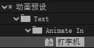
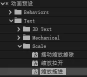
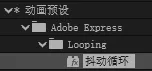
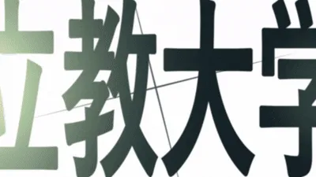
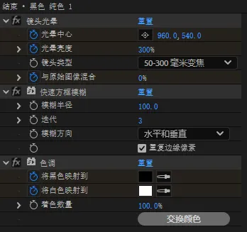
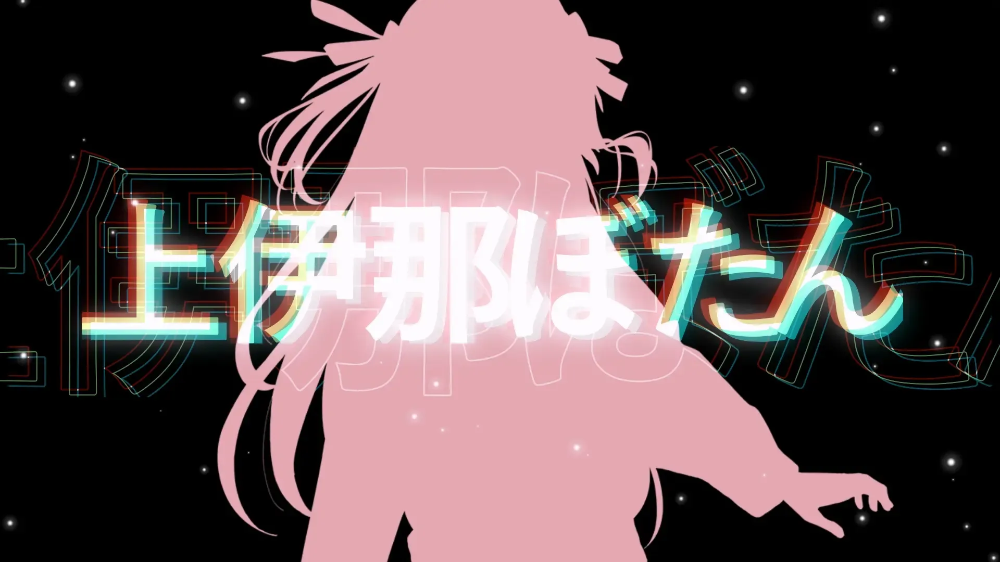
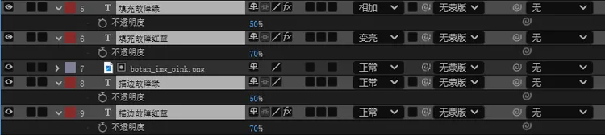
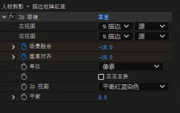
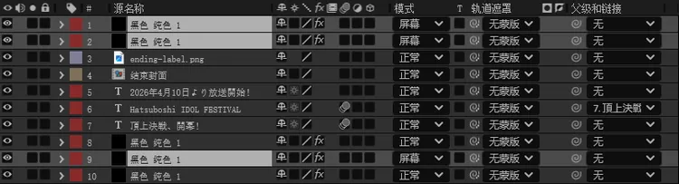
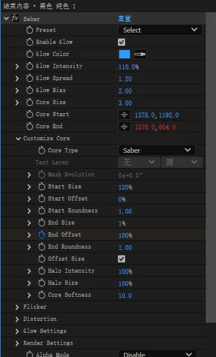

# 前言

最近看到很多H.I.F.出场的二创，也是捡起一万年没启动过的AE做了一个上伊那牡丹的

~~虽然也没有很还原原片~~，但还是稍微记一下一些效果的制作方法

成品视频如下：

<iframe width="100%" height="468" src="//player.bilibili.com/player.html?bvid=BV1VSG16SEL8&p=1&autoplay=0" scrolling="no" border="0" frameborder="no"
  framespacing="0" allowfullscreen="true"></iframe>

# 特效

## 打字效果

这个用得最多，文字从左开始逐个出现

### 实现

#### 内置预设：Text-Animate In-打字机

## 文字缩放入场

### 示例

### 实现

#### 内置预设：Text-Animate In-缩放推进

默认是放大出场，动画-范围选择器-偏移值的起始帧改为+100、结束帧改为-100就是缩小入场

## 文字抖动

### 示例

还是上面的图

### 实现

#### 内置预设：Adobe Express-Looping-抖动循环

不是文字也可以用

## 曝光/眩光/闪光+画面变色

### 示例

### 实现

#### 图层

合成最上面叠一层纯色层，混合模式改为屏幕（同一组其他的也行，我比较喜欢用屏幕）

效果从上到下：镜头光晕、任意模糊、色调

#### 镜头光晕

用来产生曝光

#### 模糊

用来平滑曝光白色边界部分，可要可不要

#### 色调

白色映射用来改变曝光中心的颜色，即被光照到的部分的颜色

黑色映射用来改变没被光照到的部分的颜色

具体按照预览的效果来调整

#### 关键帧

镜头光晕：光晕中心、光晕亮度、与原始图像混合

色调：将白色映射到、将黑色映射到

## RGB色散

### 示例

~~这个原片只有两帧，不暂停看不太出来~~

~~但我还是做了~~

### 实现

#### 图层

中间绿色（白色）不加效果

上下红蓝加上3D眼镜效果

混合模式在变亮那一组看着选

不透明度也是看着调，绿色层比红蓝层低就行

#### 3D眼镜

3D视图改为平衡红蓝染色

场景融合控制水平方向错开的距离

垂直对齐控制竖直方向错开的距离

#### 关键帧

3D眼镜：场景融合、垂直对齐

## 光柱

### 示例

图片分界的地方和右边底下伸出来的一道光

### 实现

#### 图层

叠一层纯色层加上saber效果

#### saber插件

作用是产生一束光源，用Core Start（起始点）和Core End（结束点）确定光源长度和位置，核心和发光的大小、发光都可调

Start/End Offset用来调节光源到两端点的间隔，给这个打帧比给Core Start/End打帧方便

Start/End Size用来调节光源两段粗细，值越小越尖

#### 关键帧

saber：End Offset

#### 表达式

Core End：`[effect("Saber")("Core Start")[0],effect("Saber")("Core End")[1]]`

这条用来保持两点连线竖直
